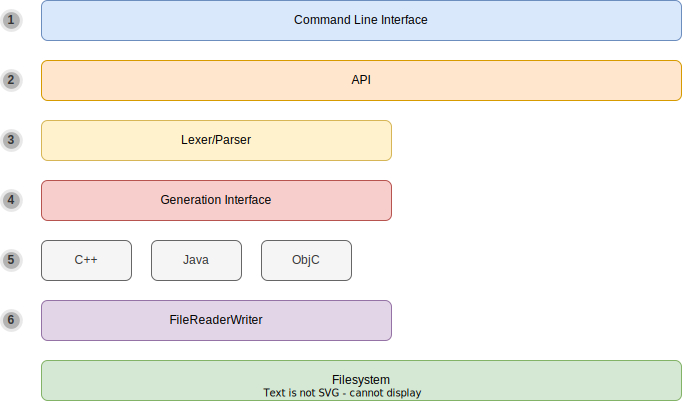

# Architecture

This document aims to give developers a rough overview over different system components, in order to make navigation
in the code base easier.

## Overview

The system has a layered architecture that heavily embraces inversion of control (see [Fig. 1](#fig_architecture_overview)).
All domain specific functionality of the system is implemented as plugins that register in the system.
The core of the application is just an abstract framework that provides the tooling that the plugins need.

<figure markdown id="fig_architecture_overview">
  { loading=lazy .invert-in-dark-mode }
  <figcaption markdown>**Fig. 1:** Overview over the layers of the PyDjinni system architecture.</figcaption>
</figure>

1. The Command Line Interface (CLI) serves as the public interface of the application that most users will use.
   Commands for each plugin are dynamically added to the interface.
2. The CLI uses the API to interact with the system. The API ties all the dependencies of the system
   together and configures all registered plugins. It can also be used by the end-user: All functionality that is
   available in the CLI (and more) can also be executed directly from Python through the API.
3. The Lexer/Parser parses the given IDL file and converts it to an AST. The AST is then traversed by each Generator
   in the system in order to produce glue code.
4. Plugins need to implement predefined interfaces to expose their functionality to the system.
   One such interface is the *Generation Interface*, that is used to generate output from the parsed AST.
5. The Interface is implemented for different target languages. Each Target can contain multiple generators, e.g.
   the *Java* Generator interface will take care of generating both Java and JNI code.
6. All file system access (except for loading the application configuration file) is performed over the `FileReaderWriter`
   object. This makes sure that all file access can be recorded and reported to the user in the form of the 
   *processed files* report.

## Generators

TODO

